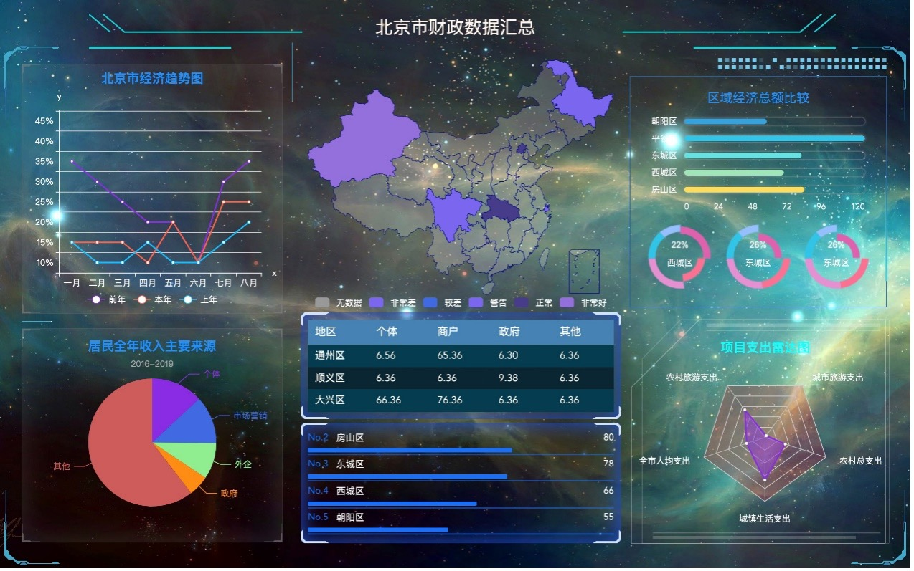

# Government
> Sorry for the irreparable loss of all the code due to computer replacement, but I have provided most of the application information of the project

# Demo

# Introduction
> The project uses Vue.js + Flask + Echarts + DataV to implement all projects
<h3>Vue</h3>
Vue.js, as a progressive framework that has been developed day by day, can realize data binding and grouping of responses, and use simple APIs to build data-driven web interfaces. Single-page applications can refresh the page locally, without having to request every page jump. All data and dom.

- The documents about Vue.js could be checked in https://vuejs.org/guide/introduction.html

<h3>Echarts</h3>
ECharts is a commercial-grade data chart, a pure Javascript chart library, which can run smoothly on PC and mobile devices, and is compatible with most current browsers (IE6/7/8/9/10/11, chrome, firefox, Safari, etc.), the bottom layer relies on the lightweight Canvas class library ZRender, providing intuitive, vivid, interactive, highly customizable data visualization charts

 The documents about Flask could be checked in https://flask.palletsprojects.com/en/2.2.x/ 

<h3>Flask</h3>
Flask is a "micro" framework for web development based on Python. The form of micro-framework gives developers more choices. The purpose of using Flask in this project is to provide a JSON data interface for the front end. Since the server program uses Flask, the Flask project team provides the Flask-SqlAlchemy extension and is highly linked to SqlAlchemy, which greatly facilitates the development of the Flask server program.

<h6> The documents about Echarts.js could be checked in https://echarts.apache.org/handbook/en/get-started/ </h6>

<h3>DataV</h3>
DataV is a Vue-based data visualization component library that provides SVG borders and decorations to enhance the visual effect of the page

> The documents about DataV could be checked in https://github.com/DataV-Team/Datav 
